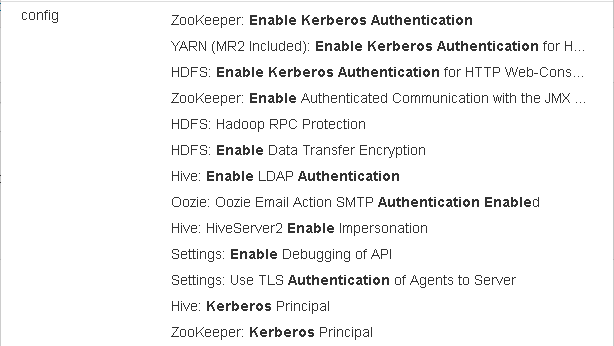
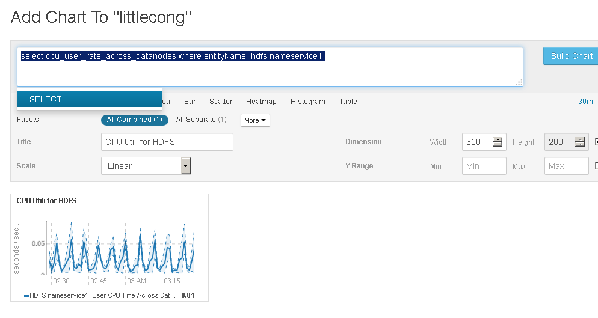
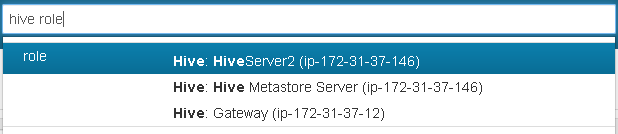

# What is ubertask optimization?
Whether to enable ubertask optimization, which runs "sufficiently small" jobs sequentially within a single JVM. "Small" is defined by the mapreduce.job.ubertask.maxmaps, mapreduce.job.ubertask.maxreduces, and mapreduce.job.ubertask.maxbytes settings.
# Where in CM is the Kerberos Security Realm value displayed?
HADOOP.COM

# Which CDH service(s) host a property for enabling Kerberos authentication?

# How do you upgrade the CM agents?

# Give the tsquery statement used to chart Hue's CPU utilization?
There is no Hue in my cluster, so I choose hdfs
```
select cpu_user_rate_across_datanodes where entityName=hdfs:nameservice1 
```



# Name all the roles that make up the Hive service


# What steps must be completed before integrating Cloudera Manager with Kerberos?
There is a Wizard in CM.  
Before using the wizard, ensure that you have performed the following steps:
* Set up a working KDC. 
* The KDC should be configured to have non-zero ticket lifetime and renewal lifetime
* OpenLdap client libraries should be installed on the Cloudera Manager Server host if you want to use Active Directory. Also, Kerberos client libraries should be installed on ALL hosts.
* Cloudera Manager needs an account that has permissions to create other accounts in the KDC.

 